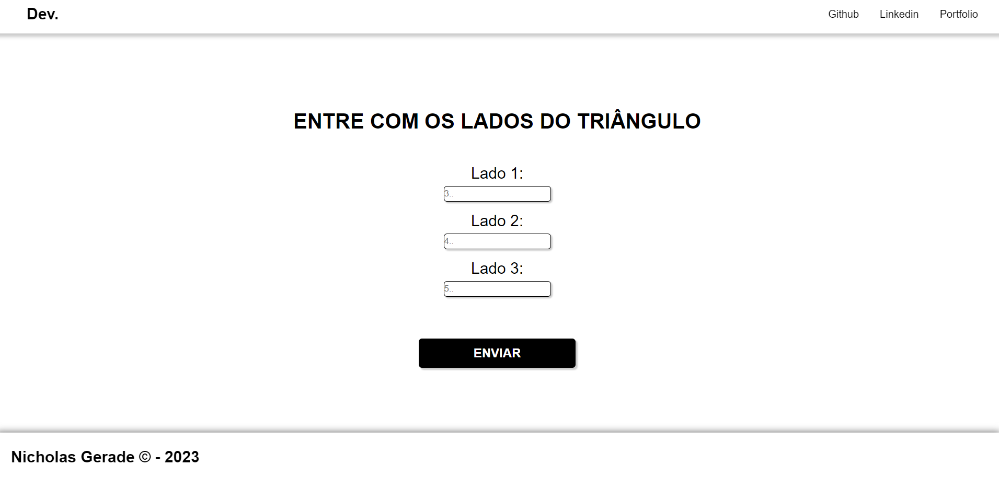

<h1 align="center"> Projeto Lado Triangulo - Php </h1>

Projeto de Site em HTML5 e CSS3 pela matéria ILP-540 desenvolvido durante o curso Análise e Desenvolvimento de Sistemas pela Fatec São Paulo    

---

 

  

---
## 💻 Tecnologias

Esse projeto foi desenvolvido com as seguintes tecnologias:

- HTML5 e CSS3
- JavaScript
- Git e Github
- Biblioteca Glider (Javascript)

---

## 🚧 Projeto

Este projeto foi desenvolvido como um Teste para dominar os principais aspectos das tecnologias HTML e CSS.

Você pode ver o site neste link: [Lados Triangulo - Php]()

--- 

